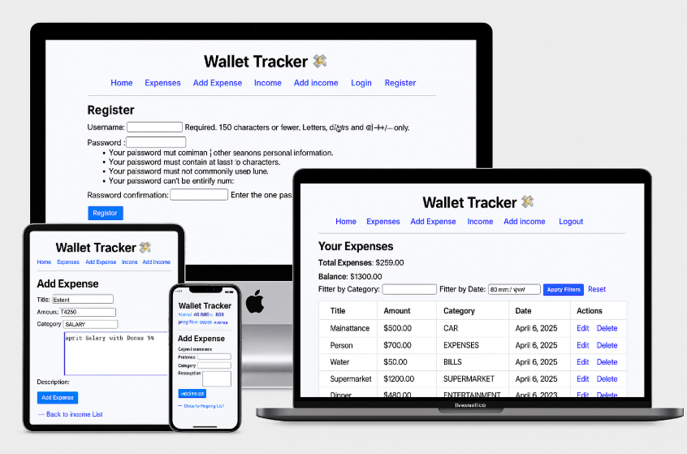

# wallet_tracker
# 💸 Wallet Tracker

Wallet Tracker is a personal finance management web app built with Django and PostgreSQL. It allows users to log in, manage their income and expenses, filter entries by category and date, and view their real-time financial balance. The goal is to provide users with a simple yet powerful tool to gain control over their personal finances.

---

## 📖 Project Story

This application was developed as part of the **Code Institute Level 5 Diploma in Web Application Development**, fulfilling the criteria for the **Data-Centric Web Development Milestone Project (Project 3)**.

Inspired by the need for a clean and focused money management app, Wallet Tracker gives users full CRUD functionality with secure authentication, clean UI, and dynamic balance calculations. The application is fully responsive and suitable for desktop, tablet, and mobile devices. 

The app demonstrates practical usage of Django, models, forms, user authentication, filtered queries, and PostgreSQL integration. It was designed and built step-by-step with Git version control, Agile Kanban planning, Heroku deployment, and detailed testing.

The live site can be found here: [Live Site - Wallet Tracker](https://wallet-tracker-7acecdc627f5.herokuapp.com/)




---


## Table of Contents

- [Wallet Tracker 💸](#wallet-tracker-💸)
  - [User Experience Design](#user-experience-design)
    - [The Strategy Plane](#the-strategy-plane)
      - [Site Goals](#site-goals)
      - [Agile Planning](#agile-planning)
      - [User Stories](#user-stories)
    - [The Scope Plane](#the-scope-plane)
    - [The Structure Plane](#the-structure-plane)
      - [Features](#features)
      - [Features Left to Implement](#features-left-to-implement)
    - [The Skeleton Plane](#the-skeleton-plane)
      - [Wireframes](#wireframes)
      - [Database Design (ERD)](#database-design-erd)
      - [Security](#security)
    - [The Surface Plane](#the-surface-plane)
      - [Design](#design)
      - [Colour Scheme](#colour-scheme)
      - [Typography](#typography)
      - [Imagery](#imagery)
  - [Technologies Used](#technologies-used)
  - [Testing](#testing)
  - [Deployment](#deployment)
    - [Version Control](#version-control)
    - [Heroku Deployment](#heroku-deployment)
    - [Run Locally](#run-locally)
    - [Fork Project](#fork-project)
  - [Credits](#credits)


---


# User Experience Design

## The Strategy Plane

### Site Goals

The Wallet Tracker 💸 app is designed to help users manage their personal finances in a simple and effective way. The core focus is to allow users to:

- Add and categorize their income and expenses.
- Track all transactions and view financial history.
- Edit or delete existing entries as their records change.
- View totals and monitor how much they’re spending or earning.
- Navigate the platform easily on mobile, tablet, or desktop.
- Use the app safely with user authentication and protected data.
- Have full CRUD functionality over income and expenses.

The app also focuses on a clean, accessible user interface and fully responsive design.

---

### Agile Planning

Agile methodology was used throughout the development of this project using GitHub Projects. Each user story was planned and executed in small, manageable tasks to ensure continuous progress.

User stories were written to capture the goals from the user’s perspective and each included clear **Acceptance Criteria** to define when a task is complete. These user stories can be viewed on the [Wallet Tracker GitHub Project Board](https://github.com/users/Omar6688/projects/6).

#### User Stories

- **Story 1: Register an account**
  - *As a new user I can to create an account so that I can log in and track my income and expenses.*
  - **Acceptance Criteria:** Registration form includes username, email, and password, confirmation message is shown after successful registration and redirect to login page.

- **Story 2: Login and logout**
  - *As a registered user I can log in and out securely so that only I can access my data*
  - **Acceptance Criteria:** Correct credentials redirect to homepage, incorrect credentials show an error and logout button appears only when logged in.

- **Story 3: Add Expense**
  - *As a logged-in user I can add an expense so that I can track my spending.*
  - **Acceptance Criteria:** Expense form includes title, amount, category, and date: form is validated and expenses are saved and visible in table format.

- **Story 4: Add Income**
  - *As a logged-in user I can record income so that I can calculate my total balance.*
  - **Acceptance Criteria:** Same structure as the expense form,income shows up in income table and total income is calculated at the top.

- **Story 5: View Financial Summary**
  - *As a user I can see total income and expenses so that I know how much money I have left.
  - **Acceptance Criteria:** Homepage shows financial summary, all values are calculated in real-timeand balance is visually separated.

- **Story 6: Edit or Delete Records**
  - *As a user I can update or remove records so that I can correct mistakes.*
  - **Acceptance Criteria:** Edit and delete buttons are available beside each item, confirmation message on delete and data updates in real-time.

- **Story 7: Deploy the project to Heroku**
  - *As a developer I can deploy the app to Heroku so that it is accessible online.*
  - **Acceptance Criteria:** The project must be pushed to Heroku using GitHub/CLI/dashboard, environment variables such as SECRET_KEY, DEBUG, and DATABASE_URL must be securely configured and the site must load correctly with static files working on Heroku.

- **Story 8: Write a professional README file**
  - *As a developer I can create a detailed README.md so that users and assessors understand the purpose, usage, and structure of the project.*
  - **Acceptance Criteria:** README includes project overview, features, and UX considerations, technologies used, setup instructions, testing, and deployment are documented, credits and licensing information are clearly listed and Markdown formatting is consistent and professional.

- **Story 9: Perform manual testing on the app**
  - *As a developer I can manually test the site functionality so that I can ensure the user flows and inputs behave as expected.*
  - **Acceptance Criteria:** All forms are tested for valid and invalid input, all views are accessible based on user authentication, expected feedback messages appear after actions and test cases are documented in the README under "Testing" section.

- **Story 10: Design an Entity Relationship Diagram (ERD)**
  - *As a developer I can create an ERD for the database structure so that others can understand the relationships between the models.*
  - **Acceptance Criteria:** ERD includes all models (e.g., User, Expense, Income), relationships (e.g., ForeignKeys) are clearly represented, Diagram is added to the documentation (README or /docs), ERD is updated if database schema changes.


  ---


  ## The Scope Plane

The Wallet Tracker 💸 project was scoped to focus on delivering essential financial tracking functionality while maintaining a clean and responsive user interface. The following features were included in the current release:

### Features

- **Homepage:** A simple welcome page that introduces the app and directs the user to log in or register.
- **User Registration and Login:**
  - Secure authentication system using Django's built-in auth.
  - Redirect users to the dashboard after login.
- **Add Income/Expense:**
  - Separate forms for income and expenses.
  - Fields include title, amount, category, and date.
  - Input validation for accurate financial data.
- **View Transactions:**
  - Clean tables showing all expenses and all income.
  - Each item includes its date, category, and amount.
- **Edit/Delete Entries:**
  - Users can update or delete any transaction.
  - Confirmation before deletion for safety.
- **Responsive Layout:**
  - Fully functional on phones, tablets, and desktop.
  - Uses flexible containers and tables for optimal UX.
- **Navigation Bar:**
  - Consistent navigation across the site.
  - Styled without underlines and with active link feedback.
- **Summary Totals:**
  - (Optional) Totals for income, expenses, and balance visible to the user.
- **Custom Error Pages:**
  - Friendly 404 and 403 pages to guide users.

---

### Features Left to Implement

These features were considered out-of-scope for this version but may be added in a future update:

- **Monthly/Yearly Report Breakdown**
  - Graphs/charts to visualize spending and earning trends.
- **Category Filtering and Search**
  - Allow users to filter transactions by category or date range.
- **User Profile Page**
  - Add user settings and profile customization.
- **Export Data**
  - Option to export income/expenses to CSV or PDF.
- **Dark Mode UI Toggle**
  - Allow users to switch between light and dark themes.


---


## The Structure Plane

The Wallet Tracker project has a clear, user-friendly structure focused on intuitive navigation and interaction. The goal is to guide users through their personal finance management tasks as efficiently as possible.

### Features and Logic Overview

#### 🔹 Navigation
- A fixed navigation bar is accessible from all pages.
- Provides links to: Home, Expenses, Add Expense, Income, Add Income.
- Adjusts dynamically based on user authentication state (Login/Logout/Register).

#### 🔹 Homepage (home app)
- Welcomes the user with the project name and an introduction.
- Encourages login/registration to access financial tools.

#### 🔹 Income and Expenses Pages (expenses app)
- Displayed as styled tables with clear column headers.
- Table rows include:
  - **Title** (capitalized),
  - **Category** (capitalized),
  - **Amount** (formatted),
  - **Date** (formatted),
  - **Edit** and **Delete** options with intuitive links.
- Income and Expenses are separated in two different views/templates.

#### 🔹 Add/Edit Forms
- Two views for adding Income and Expense entries.
- Each form includes: Title, Category, Amount, and Date fields.
- Validation is built into Django forms to ensure data accuracy.
- Users receive feedback upon submitting or updating entries.

#### 🔹 Edit/Delete Functionality
- Users can modify any entry through a pre-populated form.
- Deletion requires confirmation and redirects back to the list.
- Secured with authentication to prevent unauthorized access.

#### 🔹 Templates and Base Layout
- Uses a `base.html` template with consistent header, messages, and styling.
- All pages extend this base to maintain visual consistency.
- Templates are organized within their respective app folders (`templates/home`, `templates/expenses`, `templates/users`).

---

### Backend Structure

#### Models
- **Transaction Model** (expenses app):
  - Shared model for both income and expense.
  - Fields: title, amount, category, date, and user (ForeignKey).

#### Views
- Class-based and function-based views used.
- Django messages provide real-time feedback for actions.
- Views are separated for each action (list, create, edit, delete).

#### Authentication
- Django’s built-in `LoginView`, `LogoutView`, and `UserCreationForm` are used.
- Login-required decorators protect sensitive routes.


---


## The Structure Plane

This section describes how the Wallet Tracker app is structured, including the layout, navigation, key templates, and how users interact with the features.

---

### Navigation

The navigation bar appears consistently at the top of every page and includes links for:

- **Home** – `/`
- **Expenses** – `/expenses/`
- **Add Expense** – `/expenses/add/`
- **Income** – `/expenses/income/`
- **Add Income** – `/expenses/income/add/`
- **Login / Logout / Register** – Dynamically shown based on the user's authentication state.

Mobile responsiveness is handled through custom CSS to ensure a smooth experience on all screen sizes. A collapsible hamburger-style navigation bar is implemented for smaller screens (phones and tablets).

---

### Page Layout and Templates

The app uses Django’s template inheritance system to maintain consistent structure across all pages:

- **`base.html`** – Main layout file that includes the navigation bar, footer, and block content area for child templates.
- All other HTML files (`index.html`, `expenses.html`, `add_expense.html`, etc.) extend from `base.html`.

Each template is divided into logical blocks:
- `block title` – Defines the title for the browser tab.
- `block content` – Injects page-specific content (form, table, messages, etc.).
- `block scripts` (optional) – For page-specific JavaScript.

---

### Template Files Structure

templates/
│
├── base.html
├── index.html
│
├── expenses/
│   ├── list.html
│   ├── add.html
│   ├── edit.html
│
└── users/
    ├── login.html
    ├── register.html


### Models Overview

#### Expense Model
- `title` – Capitalized input
- `amount`
- `category` – Capitalized input
- `description`
- `date`
- `user` – Linked to the authenticated user

#### Income Model
- Same fields and structure as the Expense model

> Both models are linked to the currently logged-in user, ensuring personal financial data separation and secure access.

---

### Features and Functionality

- Full **CRUD** support for both **Expenses** and **Income** entries.
- Client-side enhancements:
  - Automatic capitalization of **title** and **category** fields.
- Success messages are shown for:
  - Creating
  - Editing
  - Deleting
- Responsive **table views** for both Income and Expenses pages.
- **Fixed and centered layout** ensures a consistent experience across desktop, tablet, and mobile devices.


---


## The Skeleton Plane

### Wireframes

Wireframes were created before development to visualize the structure and user flow across devices. The layouts were designed for:

- **Mobile view (320px+)**
- **Tablet view (768px+)**
- **Desktop view (1024px+)**

Wireframes were designed using [Balsamiq](https://balsamiq.com/), matching the final implemented layout.

> 📸 *[Insert wireframe screenshots here once available]*

---

### Database Design (ERD)

The Wallet Tracker app uses a PostgreSQL database with two core models:

#### **Expense**
- `title`: CharField – auto-capitalized
- `amount`: DecimalField
- `category`: CharField – auto-capitalized
- `description`: TextField
- `date`: DateField
- `user`: ForeignKey to the `User` model

#### **Income**
- Same fields and structure as the `Expense` model
- Linked to the logged-in user

All data is user-specific, ensuring security and privacy through foreign key relationships.

> 🗺️ *Entity Relationship Diagram (ERD) created using [drawSQL](https://drawsql.app/) or [DBDiagram](https://dbdiagram.io/).*

> 📸 *[Insert ERD image or markdown link here]*

---

### Security

Security measures implemented in this app include:

- **User Authentication**: Only authenticated users can access financial data.
- **Model-Level Protection**: Income and Expense objects are filtered per user.
- **Environment Variables**: Sensitive information is hidden in `env.py` locally and configured via Heroku Config Vars in production.
- **Custom Error Pages**: User-friendly 403 and 404 pages enhance security and usability.


---


## The Surface Plane

### Design

The Wallet Tracker app was designed with simplicity and clarity in mind. The user interface is intuitive, clean, and responsive — ensuring a smooth experience across all screen sizes (mobile, tablet, and desktop).

- Pages are centered with consistent spacing.
- Buttons and links are visually distinct and spaced appropriately.
- The header remains fixed and includes key navigation links.

---

### Colour Scheme

The app uses a professional and visually appealing color palette:

| Element         | Color Code  | Purpose                              |
|-----------------|-------------|--------------------------------------|
| Background      | `#0a192f`   | Deep navy blue for readability       |
| Text            | `#ffffff`   | White for strong contrast            |
| Buttons & Timer | `#ff8800`   | Orange for call-to-action elements   |
| Borders         | `#ffffff`   | Light contrast against dark background |

Color usage enhances UX without overwhelming the user.

---

### Typography

- **Font Family**: `'Roboto', sans-serif`
- Roboto was chosen for its modern, clean lines and readability.
- Font sizes were optimized for both desktop and mobile devices.

---

### Imagery

The app avoids heavy use of imagery to maintain performance and speed. Instead:

- Icons are used minimally and meaningfully (e.g., 💸 in the header).
- A favicon is included for branding and easy tab identification.

> 🔧 *All assets (CSS, icons, etc.) are served from the `/static/` directory using WhiteNoise.*

---


## Technologies Used

### Languages
- **HTML5** – For structuring the web pages
- **CSS3** – For styling the layout and making the app responsive
- **JavaScript** – For interactivity and dynamic user experience
- **Python** – Main backend language used with Django

### Frameworks & Libraries
- **Django** – Backend web framework for building the application
- **Gunicorn** – WSGI HTTP server used for deploying the app on Heroku
- **WhiteNoise** – Used to serve static files efficiently in production
- **jQuery** – For small DOM manipulation and dynamic behavior
- **Bootstrap (v5)** – For responsive layout and pre-styled components (optional)

### Databasegit 
- **PostgreSQL** – Production database used on Heroku
- **SQLite3** – Default development database (local use)

### Tools & Platforms
- **Git** – Version control
- **GitHub** – Remote repository hosting and project board for Agile planning
- **Heroku** – Hosting platform used for deployment
- **VS Code** – Main IDE used for development
- **Balsamiq** – For creating wireframes
- **DrawSQL / dbdiagram.io** – For designing and generating ERD diagrams

### Other Utilities
- **dotenv / env.py** – Environment variable management
- **Favicon.io** – Favicon generation tool
- **Font Awesome** – Icon library for small interface elements

> ⚙️ All dependencies are listed in `requirements.txt` and installed using `pip install -r requirements.txt`.


---


## Testing

For full testing documentation, see: [TESTING.md](TESTING.md)


---


## Deployment


### Version Control
Version control was managed using Git and GitHub. The project was developed in Visual Studio Code and pushed to a GitHub repository using the following commands:


```bash
git add .
git commit -m "Your commit message"
git push origin main
```

[GitHub Repository](https://github.com/Omar6688/wallet_tracker)


### Heroku Deployment

The Wallet Tracker app was deployed using **Heroku** with **PostgreSQL** and necessary environment variables.

#### Deployment Steps

1. **Create a new Heroku app**
   - Go to [http://heroku.com](https://heroku.com)
   - Log in and click **New > Create new app**
   - Choose a unique app name and select the region

2. **Add PostgreSQL**
   - In the **Resources** tab, search for **Heroku Postgres**
   - Select the **Hobby Dev** plan and click **Add**

3. **Set Config Vars**
   - Go to **Settings > Reveal Config Vars**
   - Add the following:
     - `DATABASE_URL` *(automatically added by Heroku)*
     - `SECRET_KEY` *(your Django secret key)*
     - `DEBUG` = `False`
     - Any other environment variables required

4. **Create a Procfile**
   - In the root directory of your project, create a file named `Procfile` (no extension)
   - Add the following line:
     ```
     web: gunicorn wallet_project.wsgi
     ```

5. **Requirements and Dependencies**
   - Ensure the following are included in your `requirements.txt`:
     ```
     gunicorn
     dj-database-url
     psycopg2
     whitenoise
     ```

6. **Update `settings.py`**
   - Add PostgreSQL configuration:
     ```python
     import dj_database_url

     DATABASES = {
         'default': dj_database_url.parse(os.environ.get('DATABASE_URL'))
     }
     ```
   - Add WhiteNoise static file config:
     ```python
     STATICFILES_STORAGE = 'whitenoise.storage.CompressedManifestStaticFilesStorage'
     ```

7. **Connect GitHub Repo**
   - In the **Deploy** tab on Heroku:
     - Connect your GitHub account
     - Choose the repository
     - Select the branch (usually `main`)
     - Click **Deploy Branch**

8. **Collect Static Files**
   - Run the following from the terminal:
     ```bash
     heroku run pyhthon manage.py migrate
     heroku run python manage.py collectstatic --noinput
     ```

---

### ✅ Live App

The project is live and can be accessed here:  
🔗 [https://wallet-tracker-7acecdc627f5.herokuapp.com](https://wallet-tracker-7acecdc627f5.herokuapp.com)

---

## Run Locally

To run the Wallet Tracker project on your own machine:

### 1. Clone the Repository

```bash
git clone https://github.com/Omar6688/wallet_tracker.git
cd wallet_tracker
```

### 2. Install Dependencies

```bash
pip install -r requirements.txt
```

### 3. Create a `.env` File

Add the following environment variables in the root directory:

```env
SECRET_KEY=your_local_secret_key
DEBUG=True
```

### 4. Run Migrations and Start the Server

```bash
python manage.py migrate
python manage.py runserver
```

#### Then visit: 
[http://127.0.0.1:800](http://127.0.0.1:8000)


---


## Fork Project

If you’d like to contribute or build your own version of this project:

- Visit the repo: [https://github.com/Omar6688/wallet_tracker](https://github.com/Omar6688/wallet_tracker)
- Click the **Fork** button (top-right corner)
- Clone your forked repo to your machine and start development:

```bash
git clone https://github.com/YOUR-USERNAME/wallet_tracker.git
cd wallet_tracker
```


---


## Credits

- **Hero Image**  
  The [hero image](https://www.pexels.com/photo/person-holding-us-dollar-banknotes-4386435/) used on the homepage was sourced from [Pexels](https://www.pexels.com), a free-to-use image platform.

- **Wireframes**  
  Wireframes were created using [Balsamiq](https://balsamiq.com/wireframes/desktop/#) to visually plan out the layout for mobile, tablet, and desktop views.

- **Favicon**  
  Favicon was generated using [Favicon.io](https://favicon.io/), an open-source favicon generator tool.

- **Color Picker**  
  Color palettes were refined using [Coolors.co](https://coolors.co/) for accessibility and consistent UI.

- **Logo & Visual Design**  
  Logo and any visual assets were created or adjusted using [Canva](https://www.canva.com/), a free design tool.

- **Image Compression**  
  [TinyPNG](https://tinypng.com/) was used to compress images and optimize loading performance.

- **Font Icons**  
  [Font Awesome](https://fontawesome.com/) was used for all iconography throughout the app.

- **External Libraries & Tools**
  - [Django](https://www.djangoproject.com/)
  - [PostgreSQL](https://www.postgresql.org/)
  - [Heroku](https://www.heroku.com/)
  - [Gunicorn](https://gunicorn.org/)
  - [Whitenoise](http://whitenoise.evans.io/)
  - [dj-database-url](https://pypi.org/project/dj-database-url/)
  - [psycopg2](https://pypi.org/project/psycopg2/)
  - [drawSQL](https://drawsql.app/) *(optional tool for ERD)*
  - [ChatGpt-AI](https://chatgpt.com)

---

### Special Thanks

- A huge thank you to my mentor Gareth for his insightful feedback, encouragement, and ongoing support throughout this project.

- Sincere thanks to **Code Institute** for providing a structured and engaging learning experience.

- Deep appreciation to the Slack community for their quick answers and motivation.


