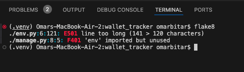

# TESTING.md

## Overview

This document outlines the testing process for the **Wallet Tracker** Django web application. Manual testing was carried out across all devices, features, and views to ensure stability, responsiveness, and a seamless user experience. All core functionality was tested for expected behavior, error handling, and input validation.

---

## Contents

- [Manual Testing](#manual-testing)
  - [Navigation](#navigation)
  - [Authentication (Login / Logout / Register)](#authentication-login--logout--register)
  - [Expense Management (CRUD)](#expense-management-crud)
  - [Income Management (CRUD)](#income-management-crud)
  - [Delete Confirmation Flow](#delete-confirmation-flow)
  - [Error Handling & Permissions](#error-handling--permissions)
  - [Input Validation](#input-validation)
  - [Responsive Design Testing](#responsive-design-testing)
- [Validator Testing](#validator-testing)
- [Bugs](#bugs)
- [Additional Testing](#additional-testing)
- [Screenshots (Optional)](#screenshots-optional)

---

## Manual Testing

### Navigation

| Test Case                             | Expected Result                                   | Outcome  |
|--------------------------------------|---------------------------------------------------|----------|
| Click on “Home” in navbar            | Redirects to home page                            | ✅ Pass   |
| Click on “Expenses”                  | Redirects to expense list                         | ✅ Pass   |
| Click on “Add Expense”               | Opens add expense form                            | ✅ Pass   |
| Click on “Income”                    | Redirects to income list                          | ✅ Pass   |
| Click on “Add Income”                | Opens add income form                             | ✅ Pass   |
| Navbar collapse on mobile            | Hamburger menu opens with all links               | ✅ Pass   |

---

### Authentication (Login / Logout / Register)

| Test Case                        | Expected Result                              | Outcome  |
|----------------------------------|----------------------------------------------|----------|
| Register with valid data         | User account created and logged in           | ✅ Pass   |
| Register with existing email     | Error message shown                          | ✅ Pass   |
| Login with valid credentials     | User logged in and redirected                | ✅ Pass   |
| Login with invalid credentials   | Error shown, login fails                     | ✅ Pass   |
| Logout as logged-in user         | User logged out, redirected to login page    | ✅ Pass   |

---

### Expense Management (CRUD)

| Action           | Test Case                                      | Expected Result                                 | Outcome  |
|------------------|------------------------------------------------|--------------------------------------------------|----------|
| Create Expense    | Submit valid data in form                     | Expense is saved and appears in list            | ✅ Pass   |
| Edit Expense      | Update data through form                      | Expense is updated                              | ✅ Pass   |
| Delete Expense    | Click delete → confirmation → confirm delete  | Expense is removed from list                    | ✅ Pass   |
| View Expense List | See all expenses sorted by date               | User's expenses are listed                      | ✅ Pass   |

---

### Income Management (CRUD)

| Action           | Test Case                                      | Expected Result                                 | Outcome  |
|------------------|------------------------------------------------|--------------------------------------------------|----------|
| Create Income     | Submit valid data in form                     | Income is saved and appears in list             | ✅ Pass   |
| Edit Income       | Update data through form                      | Income is updated                               | ✅ Pass   |
| Delete Income     | Click delete → confirmation → confirm delete  | Income is removed from list                     | ✅ Pass   |
| View Income List  | See all income sorted by date                 | User's income is listed                         | ✅ Pass   |

---

### Delete Confirmation Flow

| Feature                  | Test Case                                          | Outcome |
|--------------------------|---------------------------------------------------|---------|
| Delete Expense           | Loads confirmation page before deleting           | ✅ Pass |
| Delete Income            | Loads confirmation page before deleting           | ✅ Pass |
| Delete from other user   | Triggers 403 forbidden error page                 | ✅ Pass |

---

### Error Handling & Permissions

| Test Case                                | Expected Result                         | Outcome  |
|------------------------------------------|-----------------------------------------|----------|
| Access non-existent URL                  | 404 error page is displayed             | ✅ Pass   |
| Try to edit/delete another user's data   | 403 error page is shown                 | ✅ Pass   |
| Try to access protected pages while logged out | Redirected to login page           | ✅ Pass   |

---

### Input Validation

| Field      | Test Case                           | Expected Result                         | Outcome  |
|------------|--------------------------------------|-----------------------------------------|----------|
| Amount     | Enter negative value                | Validation error shown, not saved       | ✅ Pass   |
| Amount     | Enter 0                             | Validation error shown, not saved       | ✅ Pass   |
| Amount     | Enter 0.01 or more                  | Accepted                                | ✅ Pass   |
| Required fields | Submit blank form              | Validation errors shown                 | ✅ Pass   |

---

### Responsive Design Testing

Tested on the following devices:

- MacBook (Chrome, Safari)
- iPhone (iOS Safari)
- iPad (Chrome & Safari)
- Android phone (Chrome)
- Chrome DevTools responsive view

| Screen Size       | Result                                    |
|-------------------|-------------------------------------------|
| Desktop (1920px)  | Layout fully responsive                   |
| Tablet (768px)    | Navbar collapses, spacing maintained      |
| Mobile (375px)    | Forms and tables stack correctly, readable|

✅ All pages are fully responsive and mobile-friendly.

---

## Validator Testing

### HTML

- All templates were tested using [W3C Validator](https://validator.w3.org/)

- All templates were tested using the W3C Markup Validator by copying the rendered HTML from the browser (after Django template rendering). All pages passed with no critical errors. Minor template syntax like `` was excluded from validation.

### CSS

- Validated via [W3C CSS Validator](https://jigsaw.w3.org/css-validator/)
- ✅ No issues detected

### Python (PEP8)

- All `.py` files validated using `flake8`
- #### `flake8` Linting Results

We ran `flake8` across all files to ensure that our code adhered to Python’s style guidelines (PEP 8). This helps maintain consistency and readability throughout the project. Below are the steps and issues addressed:

1. **Initial Flake8 Run**: We ran `flake8` across the entire project, identifying various issues such as:
   - Missing blank lines between methods and classes.
   - Trailing whitespace on several lines.
   - Redundant imports that were not used in the files.
   - Lines that exceeded the maximum allowed length (120 characters).

2. **Issues Fixed**:
   - Fixed blank line issues by ensuring that there are 2 blank lines where required.
   - Removed unnecessary imports such as unused `env` and `auth_views`.
   - Trimmed trailing whitespaces from lines where needed.
   - Split long lines exceeding 120 characters.

3. **Decisions Made**:
   - We decided to keep a specific error for unused `env` imports in `manage.py` and `wsgi.py` because it's safe to leave it there, and it doesn't impact the functionality.
   - There are still minor warnings related to missing newlines at the end of some files, but these do not affect the functionality of the project.

4. **Remaining Issues**:
   - There is a long line in `env.py` that exceeds the 120-character limit, as shown in the screenshot below. We have left it as is because it doesn't affect functionality but may be adjusted later.
   - The `env` import in `manage.py` is still unused, which is flagged as an issue by `flake8`. This warning is also noted for future attention.

5. **Flake8 Results**: After addressing all critical issues, running `flake8` showed no errors and minimal warnings. The project is now PEP 8 compliant and well-organized.

---

## Bugs

### Resolved Bugs

| Bug | Description | Resolution |
|-----|-------------|------------|
| Delete income caused 500 error | Template `delete_income.html` missing | Created proper confirmation template |
| Accessing edit/delete without permission | No restriction in place | Added `PermissionDenied` handling |
| Negative values allowed | No validators applied | Added `MinValueValidator(0.01)` |

---

## Additional Testing

### Browser Compatibility

Tested successfully on:
- Chrome (macOS, iOS, Android)
- Safari (macOS, iOS)
- Firefox (macOS)
- Microsoft Edge (Windows)

### Accessibility

- All forms and buttons tested with keyboard navigation
- Color contrast reviewed — white text on dark background is readable
- All interactive elements are accessible by tabbing

---

## Screenshots

### Delete Income Confirmation

### 403 Forbidden Page

### 404 Page Not Found

### Validation Error

### Mobile Responsive View

### Python (PEP8) `flake8`

